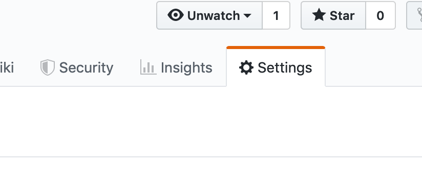
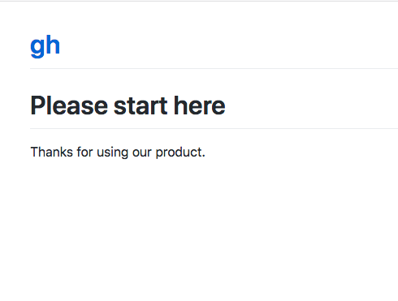
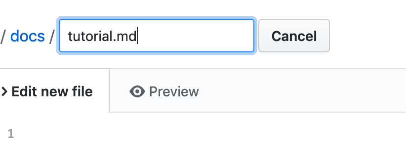

# Creating a GitHub Account

You only need to do this once:

* First [Join GitHub](https://github.com/join). It's free.

Your GitHub account is allowed unlimited public projects.
This guide shows how to create a GitHub Pages site from a public project.

## Creating a repository for your projects

* Choose the **+** symbol, then **New repository** (or just click this [Create new repository](https://github.com/new) link.

The **Create a new repository** page appears.


On some configurations you may see the **Start a project** button, so click it if so.


* Give the repository a name. Normally it's best to use lowercase letters, numbers. Instead of spaces and hyphen characters (the minus sign, or `-`) instead. It will be used as a filename, and it will be given prominence in Web searches.

* Leave **Public** checked, then choose **Create repository**. Feel free to add a descripion if you wish.

## Create a file named /docs/README.md 

The first thing needed is to create a file named specifically `README.md` capitalized exactly as shown, 
and it must go in a directory named `/docs`. Sites like the one you're creating with GitHub Pages often accompany
code for a software project and `/docs` is the logical location.

Another advantage is that if you want to use 
Jekyll features it's expected by that CMS as well.

GitHub pages sites use directory structures. Each subdirectory with pages you want published must contain
a README.md file, which will be silently converted to `index.html` files.

* Under **Quick setup — if you’ve done this kind of thing before** it says
`Get started by creating a new file or uploading an existing file. We recommend every repository include a README, LICENSE, and .gitignore`. Choose the `creating a new file` link:


* Enter `docs/README.md` and you'll see how GitHub separates the path and filename
interactively, visually distinguishing each level of the directory
hierarchy:


All GitHub Pages directory with files meant to appear in the website
must have a file named `README.md` in them.

### All pages have headers and text

Create a page that looks something like this. It doesn't matter what you write,
as long as you start the first line with a hash tag and a space, like so: `# `

```
# Please start here

Thanks for using our product.
```

The `# ` signfies a level 1 header. The text underneath it is plain text.

Let's call this page done for now. 

* At the bottom of the page choose **Commit new file**.

You can optionally put a brief note in the top line (50 characters or less by convention)
and a longer explanation under it.

Github shows the page rendered as HTML:


## Set master branch to /docs folder 

GitHub Pages and Jekyll prefer you to use a directory structure 
starting not in the root directory but in `/docs`. Inserting `/docs`
before in a path can get old. GitHub lets you avoid this by establishing it
as the base directory for your documentation site.

* From the list of sections on the middle of the page choose **Settings**:



* Find the section named **GitHub Pages**, and choose  **Source**.

* Choose **master branch /docs folder**.

Now you'll be able to avoid specifying the `/docs` folder at the base of every link.

## Open the page in GitHub pages

A new message appears above it in the **GitHub Pages** section, saying **Your site is ready to be published at ...**, 
followed by a link. Open that link in a new browser tab:



# Create a new page and link to it

Let's see how linking works by creating a second page, then linking to it from the first.

## Add an new page to the /docs directory

* Navigate back to your project directory by clicking the project name at the upper left of the page.

* Choose the `/doc` directory link. This is important because you don't want your
files to end up in the root directory.

* Choose **Create new file** and give it the name `tutorial.md`:



* Give it these contents:

```md
# Quick start tutorial

Here's how to get up and running as fast as possible.
We'll explain the details later.
```

* Move to the bottom of the page and choose **Commit changes** to save this file.

GitHub shows you the contents of the `/docs` directory. It should appear alongside README.md:


## Edit the original README.md and link to the new tutorial page


* Navigate back to your project directory by clicking the project name at the upper left of the page.

* Choose the `/doc` directory link, then choose `README.md`.

It appears rendered in HTML. 


* Click the pencil icon to edit it 
and add the following line:


```md{3}
# Please start here

Thanks for using our product.

If you want to dive right in, 
try our [quick start tutorial](tutorial.md). 
```

* Choose **Commit changes** to save.;

The HTML preview of the new `README.md` appears with 
the text you added rendered as a link:


* Click the link and you'll navigate to GitHub's preview of the tutorial page:


