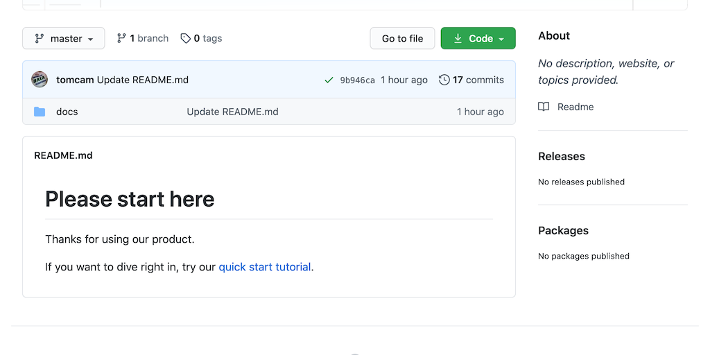

## Creating a new file on GitHub

* Choose the **Add file ▾** button.

A dropdown appears with **Create new file** and **Upload files** options.


* Choose **Create new file**.

This built-in feature of GitHub lets you create files interactively by typing right on the web page.
It's only for text files, but GitHub gives you different preview results based on the file
extension. For example, it shows basic highlighting if the file ends in `.md` because it
assumes a Markdown file. If the file ends in a programming language extension known to Git, 
say, `.js` for Javascript, it highlights the code. 
If the file ends in `.txt` or other unknown extension, it shows no formatting.

* Add some Markdown text

In the edit area, add the following text (or something like it; the literal words don't matter):

```
# Please start here

Welcome, and thanks for choosing our product.

If you want to dive right in, try our [quick start tutorial](./). 
```

## Save your changes

* Save the changes to your text by choosing the **Commit changes** button.

Why doesn't it just say **Save**? Because GitHub keeps a complete history of your document.
You will be able to restore to any commit point in history if you wish. Your audience will
also be able to suggest changes using GitHub Issues, and you'll be able to link to those
issues easily if you wish.

## See your document in preview mode

After clicking **Commit changes** ou are now looking at your file in preview mode. 
GitHub's preview mode displays all Markdown files like this, whether they are using its built-in Jekyll themes or not.



If you click the link you'll be redirected to the current directory. It's just there to show how a link looks.

## Save (commit) your new file

* At the bottom of the page choose **Commit new file**.

You can optionally put a brief note in the top line (50 characters or less by convention)
and a longer explanation under it. This comes in handy later when you have multiple
people working on the same document, or when you want a record later of why you
made a change to a document.

Github generates HTML based on the Markdown and renders the page:


