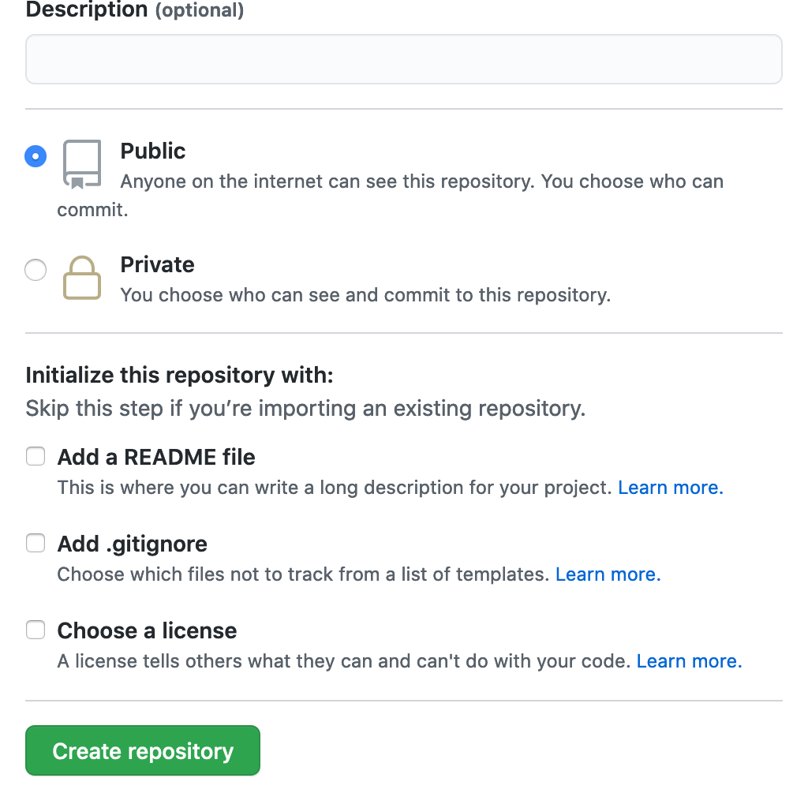
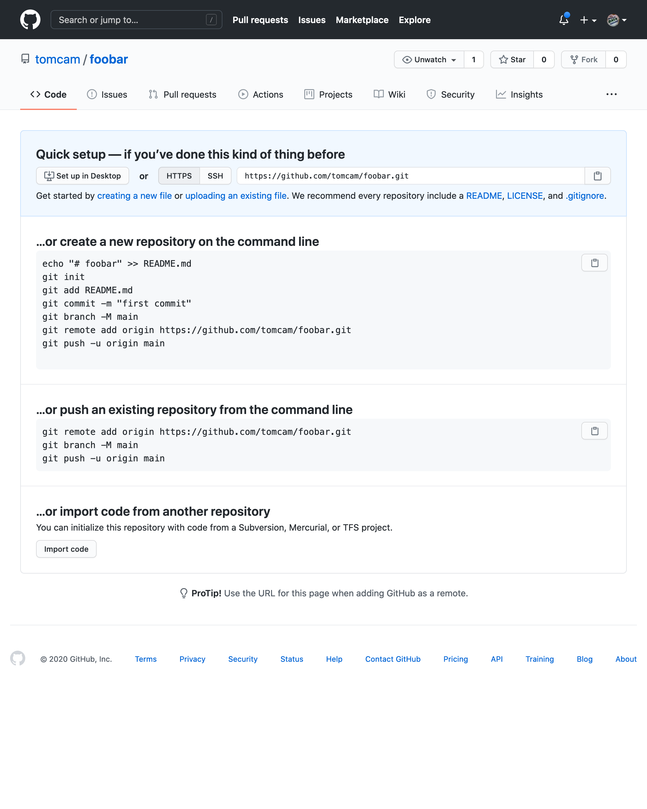

# Creating a GitHub repository for your projects

The GitHub *repository*, also konwn as a *repo*, stores your project and its entire history. 
Git allows you to go back to any commit point and reconstruct your project up to that point.
On GitHub it also has many other features, such as an effective bug/feature reporting system
called Issues, a built-in Wiki, and easy ways for other people to check out their own
versions of your (public) repository and create their own versions, then offer them back
to you if they wish.

* Choose the **+** symbol, then **New repository** (or just click this [Create new repository](https://github.com/new) link).

The **Create a new repository** page appears.


On some configurations you may see the **Start a project** button, so click it if so.


* Give the repository a name. Normally it's best to use lowercase letters, numbers. Instead of spaces and hyphen characters (the minus sign, or `-`) instead. It will be used as a filename, and it will be given prominence in Web searches.

* Leave **Public** checked. 

The **Public** option makes your repository visible to the entire Internet. You can leave it unchecked and keep your repo
private, but GitHub Pages by definition publishes the contents of the site (at least when links are supplied to those pages).

* Feel free to add a descripion if you wish. It helps the visibility of your site in search engines.

* Under **Initialize this repository with** *be sure to uncheck* the **Add a README file** checkbox. GitHub normally generates a `README.md` in the root directory. This is *not* what you want want when creating a GitHub Pages project because you want to leave `README.md` for the code
portion of a project. Even if there is no code portion, your `README.md` should not be in the root directory.



* Choose **Create repository**. 

You'll get a page that looks like this:


<a id="repo-url"></a>

## The GitHub repository URL is always https://github.com/{userid}/{reponame}

GitHub repositories all use the same naming convention, which is `https://github.com/{userid}/{reponame}`:

* Starting with with the Github URL followed by a `/` slash:

```
https://github.com/
```

* Followed by your GitHub username/account name, then by a `/` slash. The creator of this repo has the GitHub username `tomcam`, for example, so you'd have:

```
https://github.com/tomcam/
```

* Followed by the name of the repo, in this case `least-github-pages`.  The completed URL would be:

```
https://github.com/tomcam/least-github-pages
```

## Example repo URLs

* The name of the Microsoft Visual Studio Code repository is https://github.com/microsoft/vscode
* The name of the Twitter Bootstrap CSS framework repository is https://github.com/twbs/bootstrap
* The name of the https://FreeCodeCamp.org repo is https://github.com/freeCodeCamp/freeCodeCamp

The reason to beat you over the head with this is that your published website will follow its own URL naming convention, and it's easy to derive one from the other.

[Previous page](creating-github-account.md) |  [Next page](enable-github-pages.md)


#### [Home](./README.md) 

