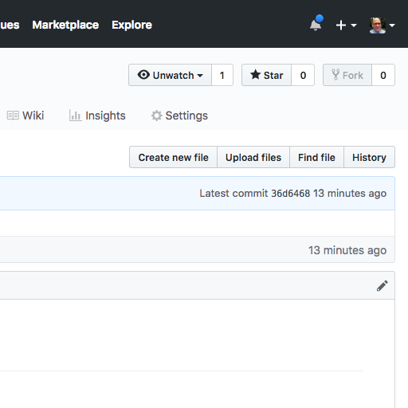
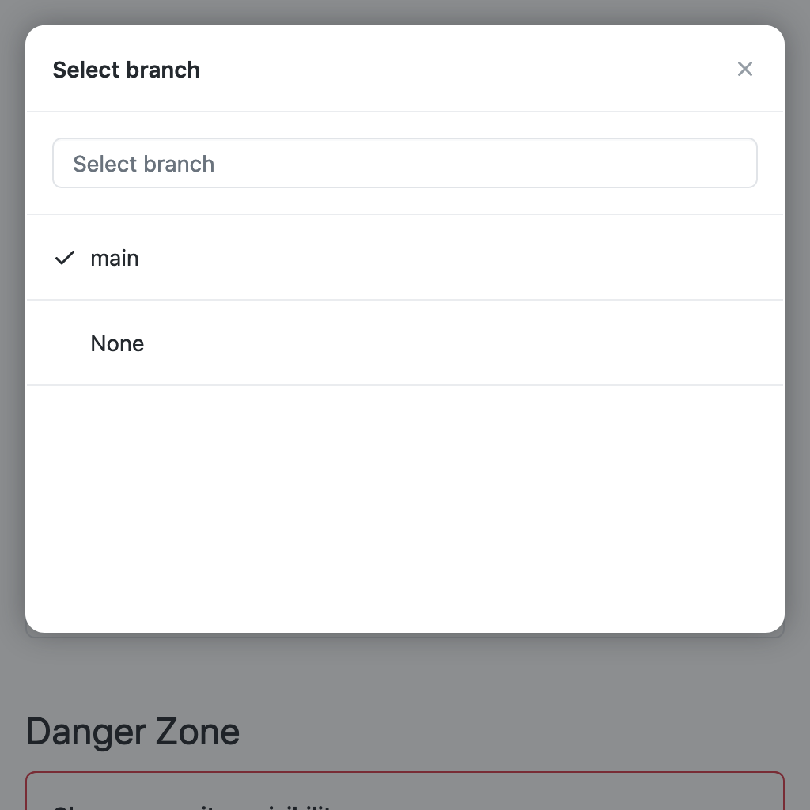
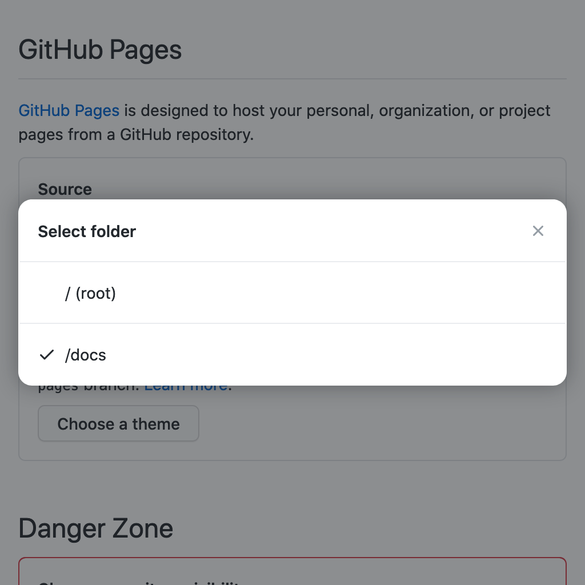
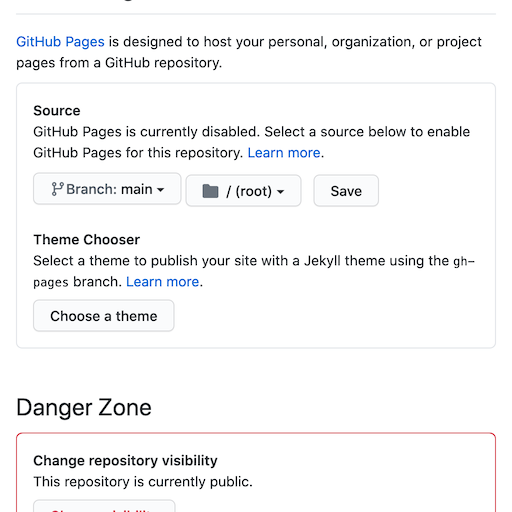

# Enable GitHub Pages

[GitHub Pages](https://pages.github.com/) hasn't been enabled yet.
Doing so will let you apply the powers of Jekyll to the markup files you've created.

* Choose the **Settings** gear icon for your repository near the upper right of the page.

The **Settings** page appears.

* Scroll down to the section called **GitHub Pages**

You'll see **Source** subheading and a button that says **None**.

A **Select branch** dropdown appears. The dropdown lets you select a source.

* From the **Select branch** subheading of the dropdown choose **main**.

* In the next button choose **/docs**:

* Choose the **Save** button:

## Warning Part 1: Your site is now visible to the entire Internet

GitHub Pages is a publishing medium. Enabling GitHub Pages on your repo means anyone with the [GitHub Pages URL to your site](github-pages-url.md)
can view it.

## Warning Part 2: You can create public sites from private repos

GitHub allows you to create private repositories. But nothing is stopping you from enabling GitHub Pages on your private repo.
Be warned that if you do so, people will be able to view GitHub Pages version of your repo.

[Previous page](creating-github-repository.md)  |  [Next page](set-github-pages-master-branch.md)

#### [Home](./README.md) 

